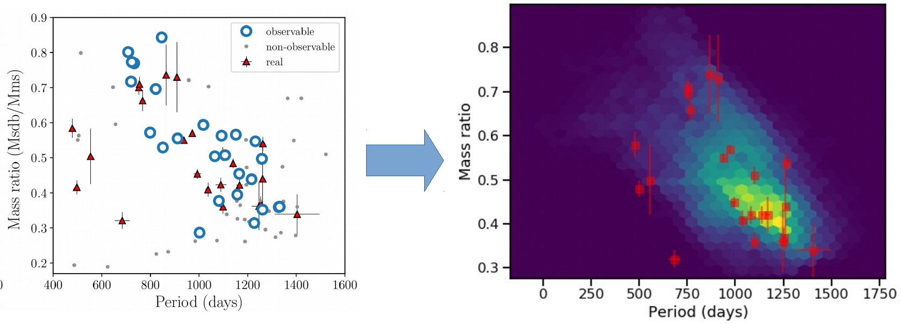
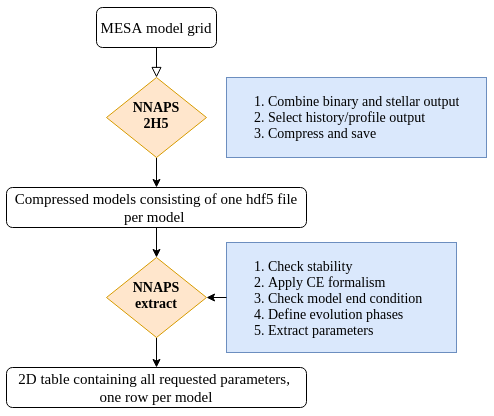

[](https://pypi.org/project/nnaps/)
[](https://nnaps.readthedocs.io/en/latest/?badge=latest)
[](https://github.com/vosjo/nnaps/blob/master/LICENSE)
[](https://doi.org/10.5281/zenodo.3988965)

# Neural Network assisted Population Synthesis code

NNaPS aims to be a simple and easy to use codebase for building a population synthesis code from a set of 1D 
stellar/binary evolution models. For example, with NNaPS, a set of MESA models can be turned into a population 
synthesis code. 

NNaPS can extract interesting parameters from a grid of MESA models and even apply a CE ejection for binary models. 

Based on the extracted grid, NNaPS trains a neural network to act as an interpolator in the provided models, and can 
then be used to predict new models, as long as their starting parameters are in the same range as those used to train 
the network. 

Lets look at an example:



The orbital period and mass ratio distribution of wide hot subdwarf binaries shows a very strong correlation. We want 
to study this correlation and predict the P-q distribution of wide sdB binaries in the galaxy. Using MESA, 2000 models 
covering the observed parameter range were calculated (blue circles in the left figure). Using NNaPS, these models 
were used to train a model and predict the P-q distribution of ~1\,000\,000 binaries (right figure). With this new
BPS model we can now further explore the P-q distribution of different sub populations in our galaxy.

If you want to try out a BPS model that was created using NNaPS you can try MESA-bps. It allows you to predict the 
orbital properties of a low mass (< 2.0 Msol) binary after its interaction phase on the red giant branch.

MESA-bps: https://mesa-bps.herokuapp.com/

## Documentation

The detailed documentation is a work in progress, you can read the current version at
[nnaps.readthedocs.io](https://nnaps.readthedocs.io/en/latest/)

## Instalation instructions

The simplest way to install the latest stable release of NNaPS is using pip.

    pip install nnaps

To uninstall NNaPS, run:

    pip uninstall nnaps
    
Warning: At the moment saving and loading of NN models requires scikit-learn version 0.22, newer or older version will 
not work. This problem is being worked on.

## Acknowledgements

If you use NNaPS in a publication, please cite:

```tex
@misc{nnaps,
  author       = {{Vos}, Joris and {Bobrick}, Alexey and {Vu{\v{c}}kovi{\'c}}, Maja},
  title        = {Neural Network assisted Population Synthesis},
  month        = aug,
  year         = 2020,
  publisher    = {Zenodo},
  version      = {0.0.1},
  doi          = {10.5281/zenodo.3988965},
  url          = {https://doi.org/10.5281/zenodo.3988965}
}
``` 

## Compress and Extract a grid of MESA models



If you have a calculate a grid of MESA models the first step is to compress the output and keep only what is of 
interest in your study. This can decrease the necessary storage space by a factor of 10 or more, and will make dealing 
with a large MESA grid on a laptop much more manageable. 

Compressing a grid of MESA runs to hdf5 format can be done with the nnaps-mesa command line tool:

    nnaps-mesa -2h5 <input folder> -o <output folder>
    
Once a MESA grid is compressed, all interesting parameters can be extracted from the models and stored in a 2D csv 
table:

    nnaps-mesa -extract <input folder> -o <output csv filename>

The produced csv file can be used to create a predictive model. See the documentation for details on the nnaps-mesa
tool.

If you would be looking for a simple tool to inspect a large grid of MESA models and their extracted parameters from
your browser, have a look at: [Track Explorer](https://github.com/vosjo/trackExplorer)

## Simple predictor

NNaPS requires a setup file or setup dictionary telling it what to do. The minimaly necessary setup includes a list 
of features and targets together with the path to the training data. Using the test data sample, the simplest model 
setup file in yaml format is the following:

```yaml
datafile: '<path to data file>'
features:
   - ...
regressors:
   - ...
classifiers:
   - ...
```

**datafile**: path to the file containing the training data.  This file is read with the pandas.read_csv() function, 
and should be structured in an appropriate way.  
**features**: a list of the features to use when predicting a model. Think of these as the X parameter of your 
prediction function.  
**regressors**: a list of the numerical targets for the model. These are the Y parameters of the prediction function. 
A regressor has to he a continuous numerical value. For a categorical numerical value use a classifier.  
**classifiers**: a list of the categorical targets for the model. These are the Y parameters that are not numerical, 
or the not continuous. 

The entire process of fitting the data and predicting the targets of new data can be as simple as:

```python
from nnaps import predictors
    
predictor = predictors.FCPredictor(setup_file='setup.yaml')
    
predictor.fit(epochs=100)

new_predictions = predictor.predict(new_data)
```

Let's go over all steps in a bit more detail:

#### The data

Lets check the data. In this example we will use the test data provided in the test directory of the NNaPS package. 
```python
import pandas as pd

data = pd.read_csv('tests/BesanconGalactic_summary.txt')
    
print(data.head())
```    

|    |   M1  |  Pinit     | qinit    | FeHinit   | Pfinal     | qfinal   | product | binary_type  |
|----|-------|------------|----------|-----------|------------|----------|---------|--------------|
|  0 | 0.744 | 134.470005 | 1.095729 | -0.912521 | 294.031588 | 0.608444 | He-WD   | single-lined |
|  1 | 0.813 | 225.000014 | 2.524845 | -0.806781 | 153.634007 | 1.031585 | He-WD   | single-lined |
|  2 | 0.876 | 111.550009 | 2.190000 | -0.918768 | 104.970587 | 0.912802 | He-WD   | single-lined |
|  3 | 0.890 | 512.700045 | 2.386059 | -0.878982 | 394.729424 | 1.396449 | HB      | single-lined |
|  4 | 0.893 | 102.630007 | 1.485857 | -0.731017 | 228.613065 | 0.640067 | He-WD   | double-lined |

The dataframe contains the features, which are all numerical continuous variables: M1, Pinit,qinit and FeHinit. 
And the 4 targets: Pfinal, qfinal, product and binary_type. The first two targets are also continuous numerical
variables and are thus regressors. The last two targets are categorical variables, and are thus classifiers.  

Based on this knownledge, we can make te following setup file:

```yaml
datafile: 'tests/BesanconGalactic_summary.txt'
features:
   - M1
   - qinit
   - Pinit
   - FeHinit
regressors:
   - Pfinal
   - qfinal
classifiers:
   - product
   - binary_type
```

#### Setting up the model and training

Using the setup file a predictor can be constructed and fitted:

```python
from nnaps import predictors
    
predictor = predictors.FCPredictor(setup_file='test_setup.yaml')
    
predictor.fit(epochs=100)
```    

    Train on 1648 samples, validate on 412 samples
    Epoch 1/100
     - 2s - loss: 696880.9575 - Pfinal_loss: 695673.0000 - qfinal_loss: 0.2186 - product_loss: 1.8115 - binary_type_loss: 0.6274 - Pfinal_accuracy: 0.0000e+00 - Pfinal_mae: 607.1440 - qfinal_accuracy: 0.0000e+00 - qfinal_mae: 0.3886 - product_accuracy: 0.1475 - product_mae: 0.2783 - binary_type_accuracy: 0.7737 - binary_type_mae: 0.4420 - val_loss: 808298.6068 - val_Pfinal_loss: 767784.4375 - val_qfinal_loss: 0.1991 - val_product_loss: 1.8002 - val_binary_type_loss: 0.6387 - val_Pfinal_accuracy: 0.0000e+00 - val_Pfinal_mae: 603.3589 - val_qfinal_accuracy: 0.0000e+00 - val_qfinal_mae: 0.3821 - val_product_accuracy: 0.1723 - val_product_mae: 0.2781 - val_binary_type_accuracy: 0.7621 - val_binary_type_mae: 0.4410
    Epoch 2/100
     - 0s - loss: 696340.1365 - Pfinal_loss: 696977.0625 - qfinal_loss: 0.2867 - product_loss: 1.8291 - binary_type_loss: 0.5913 - Pfinal_accuracy: 0.0000e+00 - Pfinal_mae: 606.6785 - qfinal_accuracy: 0.0000e+00 - qfinal_mae: 0.4482 - product_accuracy: 0.1056 - product_mae: 0.2791 - binary_type_accuracy: 0.7779 - binary_type_mae: 0.4019 - val_loss: 807560.4800 - val_Pfinal_loss: 767050.8750 - val_qfinal_loss: 0.2407 - val_product_loss: 1.8078 - val_binary_type_loss: 0.6247 - val_Pfinal_accuracy: 0.0000e+00 - val_Pfinal_mae: 602.7472 - val_qfinal_accuracy: 0.0000e+00 - val_qfinal_mae: 0.4202 - val_product_accuracy: 0.0267 - val_product_mae: 0.2784 - val_binary_type_accuracy: 0.7621 - val_binary_type_mae: 0.3860
     ...
     Epoch 100/100
     - 0s - loss: 97412.9127 - Pfinal_loss: 96999.7812 - qfinal_loss: 0.0905 - product_loss: 1.1475 - binary_type_loss: 0.4588 - Pfinal_accuracy: 0.0000e+00 - Pfinal_mae: 161.2016 - qfinal_accuracy: 0.0000e+00 - qfinal_mae: 0.2201 - product_accuracy: 0.6383 - product_mae: 0.1970 - binary_type_accuracy: 0.8149 - binary_type_mae: 0.3309 - val_loss: 223666.4350 - val_Pfinal_loss: 184591.3125 - val_qfinal_loss: 0.0667 - val_product_loss: 1.1004 - val_binary_type_loss: 0.4510 - val_Pfinal_accuracy: 0.0000e+00 - val_Pfinal_mae: 155.4490 - val_qfinal_accuracy: 0.0000e+00 - val_qfinal_mae: 0.2007 - val_product_accuracy: 0.6893 - val_product_mae: 0.2050 - val_binary_type_accuracy: 0.8350 - val_binary_type_mae: 0.3043

This creates the predictor using a the 'test_setup.yaml' file, and then trains it on the provided data. The number of 
epochs is the number of iterations to be used in the gradient descent learning. After learning you can check the report
if the model is good enough, or if more iterations are necessary.

#### Checking the learning progress

After training the predictor, you can check how well it managed to fit the training data. Before it started fitting, 
the predictor set part of the training data separate to test how well it's predictions are. This is the validation
set. By checking how well the predictor works for this data, you can get an idea of the expected error on new data.

You can save the training report to html file as follows:

```python
predictor.make_training_history_report('report.html')

``` 

#### Making predictions

When you are satisfied that your model is good enough, you can make predictions on new data.

Predicting new models is then as simple as providing a pandas DataFrame with the features (X parameters) of the new
models you want to predict to the BPS_predictor. We can have the system predict the targets for the 100 - 110th
training sample. 

```python  
new_predictions = predictor.predict(data=data.iloc[100:110])

print(new_predictions)
```

|   | Pfinal     | qfinal   | product | binary_type  |
|---|------------|----------|---------|--------------|
| 0 | 1448.75939 | 0.613978 | HB      | single-lined |
| 1 | 771.150024 | 0.432204 | He-WD   | single-lined |
| 2 | 254.810944 | 0.295612 | He-WD   | single-lined |
| 3 | 455.564545 | 0.348135 | He-WD   | single-lined |
| 4 | 583.579712 | 0.381909 | He-WD   | single-lined |
| 5 | 150.147385 | 0.267372 | He-WD   | single-lined |
| 6 | 565.826782 | 0.378209 | He-WD   | single-lined |
| 7 | 1213.60022 | 0.551243 | HB      | single-lined |
| 8 | 2370.94384 | 0.859896 | HB      | single-lined |
| 9 | 337.348907 | 0.316895 | He-WD   | single-lined |    

new_predictions is a pandas dataframe with the predictions and features of the provided.

The trained model can be saved to hdf5 format and loaded again for later use:

```python  
predictor.save_model('model.h5')
```

Loading a saved models can be done in two ways:

```python
# load into an existing predictor object
predictor.load_model('model.h5')

# or create a new predictor object from the saved model
predictors.BPS_predictor(saved_model='model.h5')
``` 


## Advanced predictor

It is possible to define many more setting in the setup file. A complete setupfile would look like:

```yaml
datafile: 'tests/BesanconGalactic_summary.txt'

features:
   M1:
      processor: StandardScaler
   qinit:
      processor: StandardScaler
   Pinit:
      processor: StandardScaler
   FeHinit:
      processor: StandardScaler
regressors:
   Pfinal:
      processor: None
      loss: mean_absolute_percentage_error
   qfinal:
      processor: None
      loss: mean_squared_error
classifiers:
   product: 
      processor: OneHotEncoder
      loss: categorical_crossentropy
   binary_type:
      processor: OneHotEncoder
      loss: categorical_crossentropy

random_state: 42
train_test_split: 0.2

model:
   - {'layer':'Dense',   'args':[100], 'kwargs': {'activation':'relu', 'name':'FC_1'} }
   - {'layer':'Dropout', 'args':[0.1], 'kwargs': {'name':'DO_1'} }
   - {'layer':'Dense',   'args':[75],  'kwargs': {'activation':'relu', 'name':'FC_2'} }
   - {'layer':'Dropout', 'args':[0.1], 'kwargs': {'name':'DO_2'} }
   - {'layer':'Dense',   'args':[50],  'kwargs': {'activation':'relu', 'name':'FC_3'} }
   - {'layer':'Dropout', 'args':[0.1], 'kwargs': {'name':'DO_3'} }

optimizer: 'adam'
optimizer_kwargs: {'learning_rate':0.001, 'beta_1':0.9, 'beta_2':0.999}
batch_size: 128
```


