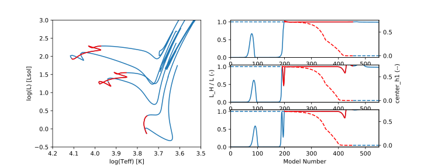
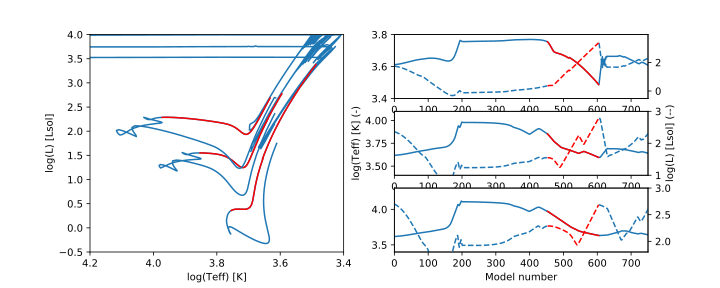
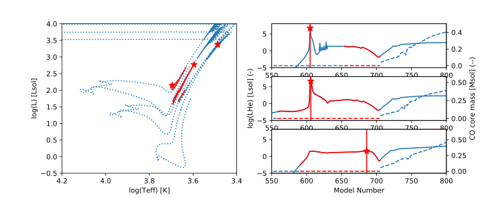

MESA Evolution Phases
=====================

Evolution phases defined in NNaPS-mesa:

================================== ===================================================== =================================================
 Name                               Function                                              Description
================================== ===================================================== =================================================
:ref:`Init<start-end>`             :func:`~nnaps.mesa.evolution_phases.init`             the first evolution point
:ref:`Final<start-end>`            :func:`~nnaps.mesa.evolution_phases.final`            the last evolution point
:ref:`MS<ms>`                      :func:`~nnaps.mesa.evolution_phases.MS`               the main sequence phase
:ref:`MSstart<ms>`                 :func:`~nnaps.mesa.evolution_phases.MSstart`          the start of the MS phase
:ref:`MSend<ms>`                   :func:`~nnaps.mesa.evolution_phases.MSend`            the end of the MS phase
:ref:`RGB<rgb>`                    :func:`~nnaps.mesa.evolution_phases.RGB`              the red giant branch / first giant branch phase
:ref:`RGBstart<rgb>`               :func:`~nnaps.mesa.evolution_phases.RGBstart`         the start of the RGB phase
:ref:`RGBend<rgb>`                 :func:`~nnaps.mesa.evolution_phases.RGBend`           the end of the RGB phase
:ref:`HeIgnition<he-burning>`      :func:`~nnaps.mesa.evolution_phases.HeIgnition`       the moment of first He ignition
:ref:`HeCoreBurning<he-burning>`   :func:`~nnaps.mesa.evolution_phases.HeCoreBurning`    the He core burning phase
:ref:`HeShellBurning<he-burning>`  :func:`~nnaps.mesa.evolution_phases.HeShellBurning`   the He shell burning phase
:ref:`sdA<sd>`                     :func:`~nnaps.mesa.evolution_phases.sdA`              the subdwarf A type phase
:ref:`sdB<sd>`                     :func:`~nnaps.mesa.evolution_phases.sdB`              the subdwarf B type phase
:ref:`sdO<sd>`                     :func:`~nnaps.mesa.evolution_phases.sdO`              the subdwarf O type phase
:ref:`He-WD<wd>`                   :func:`~nnaps.mesa.evolution_phases.He_WD`            the He white dwarf phase
:ref:`ML<ml>`                      :func:`~nnaps.mesa.evolution_phases.ML`               the first mass loss phase
:ref:`MLstart<ml>`                 :func:`~nnaps.mesa.evolution_phases.MLstart`          the start of the MS phase
:ref:`MLend<ml>`                   :func:`~nnaps.mesa.evolution_phases.MLend`            the end of the ML phase
:ref:`CE<ce>`                      :func:`~nnaps.mesa.evolution_phases.CE`               the first common envelope phase
:ref:`CEstart<ce>`                 :func:`~nnaps.mesa.evolution_phases.CEstart`          the start of the CE phase
:ref:`CEend<ce>`                   :func:`~nnaps.mesa.evolution_phases.CEend`            the end of the CE phase
================================== ===================================================== =================================================

.. _start-end:

Init - Final
------------

Init and Final are the two most straightforward phases, they indicate respectively the first and the last evolution
time step. No extra parameters are necessary to distinguish these phases. They are encoded by respectively the
:func:`~nnaps.mesa.evolution_phases.init` and :func:`~nnaps.mesa.evolution_phases.final` function.

Depending on how you setup the MESA evolution model, it is possible that the last model does not get saved in the
history file. This could cause a discrepancy between the max_model_number set in MESA and the output of the 'final'
phase.

.. _ms:

Main Sequence
-------------

The Main sequence phase is defined as the phase where hydrogen burning takes place is the core. The MSstart and MSend
phases mark the first and last moment matching with the core hydrogen burning phase.

Specifically core hydrogen burning is defined as the time period starting when the majority of the energy is produced
by nuclear reactions, and ending when the core hydrogen runs out.

start: 10^log_LH > 0.999 * 10^log_L

end: center_h1 < 1e-12

Required history parameters:
    - log_L
    - log_LH
    - center_h1
    - age

The MS phase together with the parameters used to define the start and end point, for stars with 1, 2 and 3 solar
masses is shown in the figure below:

.. _rgb:

Red Giant Branch
----------------

The red giant phase is defined as the phase starting at the end of the MS, and continuing until either a minimum in
effective temperature or a maximum in luminosity is reached (whichever comes first) before He burning stars.

Specifically, the start is defined in the same way as the end of the MS phase, based on central hydrogen, and the end
is defined based on Teff and log_L before the central He fraction is reduced:

start: center_h1 < 1e-12

end: ( Teff == min(Teff) or log_L == max(log_L) ) and center_He >= center_He_TAMS - 0.01

Required history parameters:
    - center_h1
    - center_he4
    - effective_T
    - log_L
    - age

The RGB phase together with the parameters used to determine its end for stars with a mass of 1, 2 and 3 solar masses
is shown in the figure below.

.. _he-burning:

He Burning
----------

The He burning phase, can be split up in the moment of He ignition (called HeIgnition), the phase of burning He in the
core (HeCoreBurning) and the phase of burning He in a Shell (HeShellBurning). These phases are defined as follows:

He ignition:
    The moment of He ignition is defined by a peak in the He luminosity. This is the first moment of He ignition,
    but is not necessarily in the core as for low mass stars, He ignition occurs under degenerate conditions, and due
    to neutrino cooling typically happens in a shell around the core.

    Ignition is defined as the point with the maximum LHe between the first moment when LHe > 10 Lsol and the formation
    of the carbon-oxygen core. This corresponds to the (first) He flash.

    Required history parameters:
        - log_LHe
        - c_core_mass
        - age

He Core burning:
    He core burning is defined as the period between ignition of He in the core and formation of CO core.

    He ignition in the core is defined as the first moment when both the temperature and density in the core are
    sufficiently high to allow He burning. NNaPS uses the same conditions to define the ignition criteria as MESA.

    CO core formation is defined as the point in time when the CO core reaches as mass of 0.01

    start: log_center_T > He_Ignition_Limit[log_center_Rho]

    end: CO core mass > 0.01 Msol

    Required history parameters:
        - log_center_T
        - log_center_Rho
        - log_LHe
        - c_core_mass
        - age

He Shell burning:
    The He shell burning phase is defined as the period in time between the formation of the CO core, and the final
    drop in He luminosity indicating the end of He burning. This final drop is defined as the time when LHe drops
    below half the LHe at the start of He shell burning.

    start: CO core mass > 0.01 Msol

    end: LHe < 1/2 * LHe[start of shell burning]

    Required history parameters:
        - log_LHe
        - c_core_mass
        - age

The He core burning phase and the moment of ignition is shown together with some of the criteria for stars with a mass
of 1, 2 and 3 solar masses in the figure below.

.. _sd:

Subdwarf phases
---------------

Subdwarfs phases are implemented in NNaPS based on their evolutionary definition, not based on their spectroscopic
definition. This means that a subdwarf is defined as a core He burning star that has lost its envelope and therefor
has a much higher effective temperature as a typical core He burning star. The temperature ranged for the three
different subdwarfs are defined as:

    - sdA: 15000 - 20000 K
    - sdB: 20000 - 40000 K
    - sdO: > 40000 K

Required history parameters:
    - log_center_T
    - log_center_Rho
    - log_LHe
    - c_core_mass
    - log_Teff
    - age

.. _wd:

White dwarfs
------------

White dwarfs are defined based on their effective temperature and logg. The WD cooling track is selected to start when
Teff < 10000K and logg > 7, or when logg > 7.5 regardless of Teff

NNaPS differs between He and CO WDs based on their core composition. If the mass of the CO core is less than 0.01 Msol,
it is a He-WD, if the mass is higher it is a CO WD.

Required history parameters:
    - log_LHe
    - c_core_mass
    - log_Teff
    - log_g
    - age

.. _ml:

Mass loss
---------

The first occurring mass loss phase, where the mass loss phase is defined as the period in time when the primary is
losing mass at a rate of at least log(Mdot) >= -10.
This phase only marks mass loss due to RLOF. Mass loss due to winds is not taken into account when flagging a ML
phase. In practice, the mass loss rate due to RLOF is defined as:

    lg_mass_loss_rate = log10( 10^lg_mstar_dot_1 - 10^lg_wind_mdot_1 )

Required history parameters:
        - lg_mstar_dot_1
        - lg_wind_mdot_1
        - age

.. _ce:

Common Envelope
---------------

The CE phase only contains the start and end point of the CE phase. For more information on how it is determined, see
the documentation on the common envelope calculation in NNaPS: :ref:`common_envelope`

